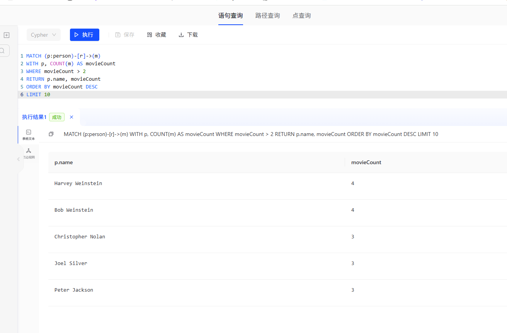
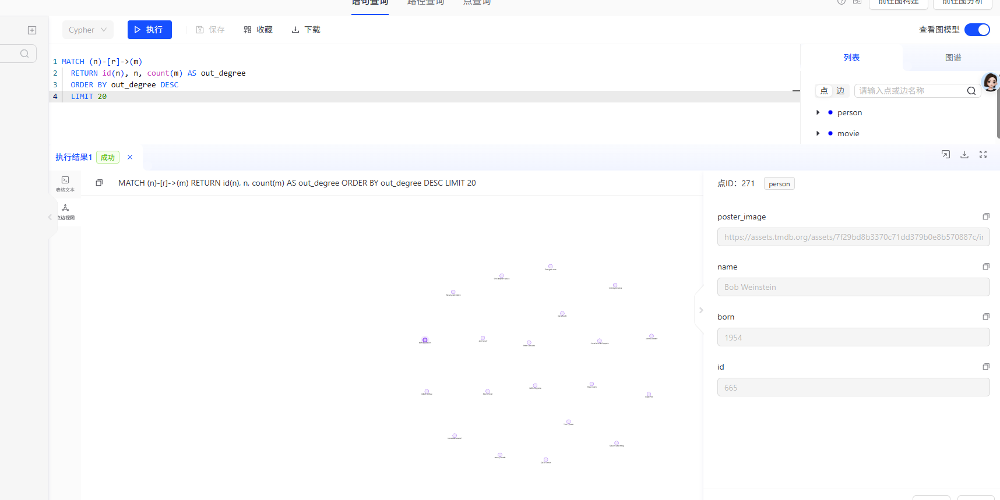
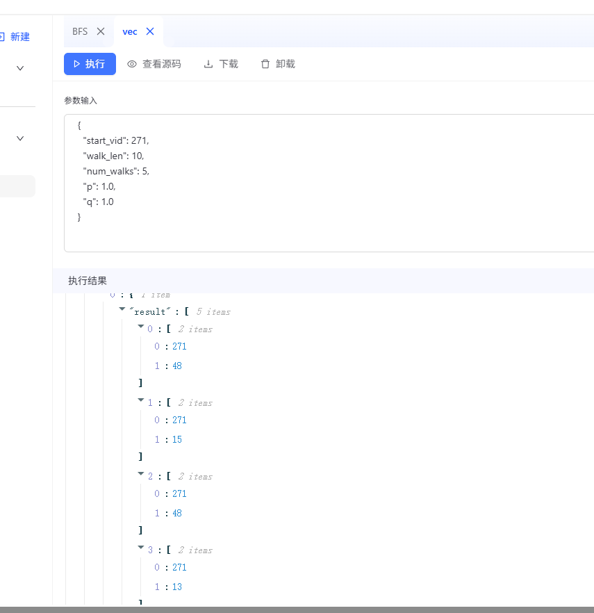

# 安全通论实验二

## 执行一次复杂查询

执行以下示例查询，查询出演过超过两部电影的演员，并按照出演电影数量降序排列，返回前10名演员的姓名和出演电影数量。

```cypher
MATCH (p:person)-[r]->(m)
WITH p, COUNT(m) AS movieCount
WHERE movieCount > 2
RETURN p.name, movieCount
ORDER BY movieCount DESC
LIMIT 10
```


## node2vec运行采样

- 将node2vec算法导入存储过程中，运行采样，生成随机游走序列


- 注意到：

start_vid=100 不是 node.id=100                 
```python                                                          
v = txn.GetVertexIterator(vid)                         
```                                                                                                                                                        
这里的 vid 是 TuGraph 内部顶点 ID，不是图里节点属性id。                                                                                                                                                               
所以：                                                                                                                                                                                                                  
                                                         
  "start_vid": 100                                                                                                                                                                                                         
                                                                                                                                                                                                                           
  表示“从 TuGraph 内部 vid=100 的顶点开始”，不一定是：                                                                                                                                                                     
                                                                                                                                                                                                                           
  (n:node {id:100})

- 执行查询找到一个有出边的节点的 vid：

```cypher
MATCH(n)-[r]->(m)
RETURN id(n),n, count(m)As out_degreeORDER BY out degree DEsC
LIMIT 20
```


- 以 vid=271 的节点为起点，运行 node2vec 采样：



## node2vec 完整算法实现
- 构建完整的node2vec算法实现脚本
  [auto_node2vec_bolt_train.py](auto_node2vec_bolt_train.py)
遍历数据库中的全部节点，选择有出边的节点作为起点，运行node2vec采样，生成随机游走序列:
[node2vec_walks.json](node2vec_walks.json)

- 然后将随机游走序列输入到word2vec模型中进行训练，得到节点的向量表示。
[node2vec_embeddings.json](node2vec_embeddings.json)

运行并查看结果：
```bash
Node2Vec 自动训练完成
数据库: default
节点数: 719
边数: 60
选取的起点内部 vid: [271, 272, 67, 205, 270, 163, 300, 303, 65, 66, 115, 117, 118, 134, 162, 232, 234, 235, 276, 325]
随机游走条数: 100
embedding 节点数: 39
embedding 维度: 64

随机游走结果示例（前 5 条）:
[271, 13]
[271, 13]
[271, 21]
[271, 15]
[271, 15]

embedding 示例（前 3 个节点，每个只展示前 8 维）:
node=4, embedding前8维=[-0.012847229838371277, 0.008566310629248619, 0.004851328209042549, -0.0019103015074506402, -0.002067186636850238, 0.011188016273081303, -0.012957306578755379, 0.006167180370539427]
node=11, embedding前8维=[-0.0027975309640169144, -0.005454735830426216, 0.012678875587880611, -0.004047555383294821, -0.01323354709893465, -0.000957691459916532, 0.009238719008862972, -0.009700429625809193]
node=3, embedding前8维=[0.0023267152719199657, 0.004209257196635008, 0.002045242814347148, 0.0016658240929245949, -0.012791319750249386, 0.0018516163108870387, 0.009215335361659527, -0.006128774024546146]
```
